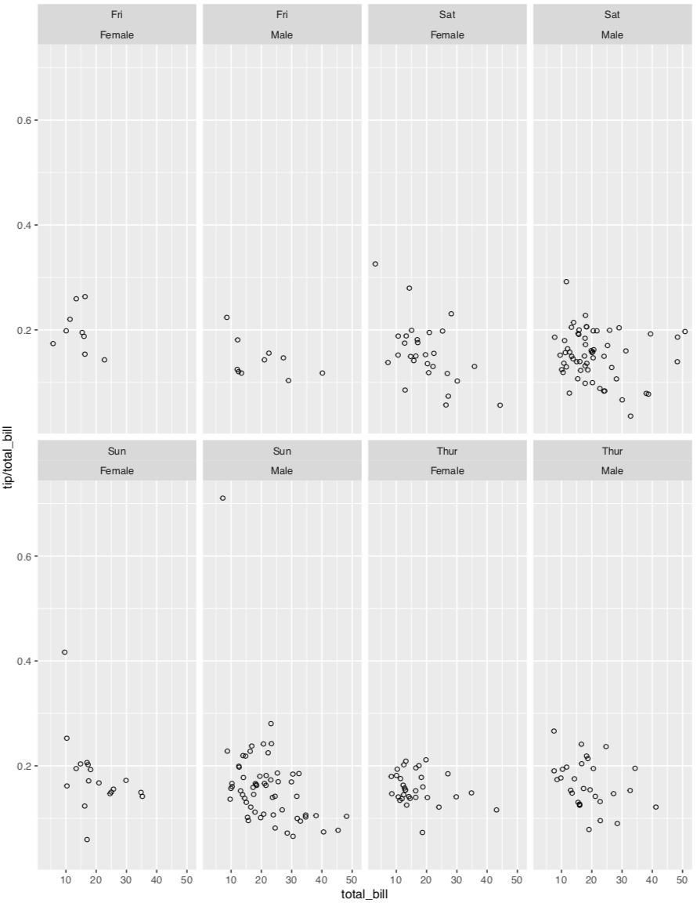

**目录：**

[TOC]

# $\rm I$. 课程概览

本次课程的内容进入到**探索性分析**部分，课程将使用 R 来开展探索性数据分析。探索性分析是更大的数据收集、了解数据以及进行相应操作的过程，并最终揭示数据的意义——探索数据及变量之间的关系，在方法上可以使用数字和图形可视化。在作用上，是为了发现数据中信息点以及新的探索角度，同时可以在这个过程中验证数据假设以及检验直觉判断。同时这个阶段是为数据分析后续阶段提供参考和依据。

# $\rm II$. R 编程

课程中将使用 R 语言来进行编程，在工具选择上可以选择 [RStudio](https://www.rstudio.com/)。接下来将从 R 编程基础开始，之后回到课程内容部分。R 和 Python 一样都是解释性、动态类型语言，在语言上有一些相同点，当然也存在不同的差异点。可以将两个语言进行类比，可以以此学习。

|    目的    | R 方法                                                       | Python 方法                                                  |
| :--------: | :----------------------------------------------------------- | :----------------------------------------------------------- |
|  寻求帮助  | 使用 `?mean` 表示查找 `mean`函数帮助，相当于使用`help("mean")` `??plotting` 表示寻求 `plotting` 帮助，相当于使用 `help.search("plotting")` `typeof(object)` 查看对象类型，此外还可以使用 `mode` | `help(object)` 查看函数和模块用途 `dir(object)` 查看属性列表[^1] `type(object)` 查看对象类型 |
|   包管理   | `install.packages("package_name")`  `update.packages(ask=FALSE)` `remove.package("package_name")` | `pip install package_name` `pip update package_name` `pip remove pakcage_name` |
|   调用包   | `library(package_name)` ，包名称不需要加引号                 | 使用 `import ` 语句                                          |
|  赋值方式  | 可以使用 `<-` 或者 `=`，推荐使用 `<-`                        | 使用 `=`                                                     |
|   变量名   | 区分大小写，可以使用 `.` 作为变量名一部分； 如果是 `.` 做第一个字符，第二个字符只能是字母[^3] | 区分大小写                                                   |
|  数据类型  | 基本数据对象类型：数值型、字符型、复数型、布尔型、向量 其他结构对象：因子、数组、矩阵、数据框、列表、时间序列 | 基本数据对象：数值型、字符型、布尔型 容器对象：列表、元组、字典、集合 |
| 算数运算符 | 保留了 `+`, `-`, `*`, `/`；指数标识符可以使用 `^` 或者 `**`  | 保留 `+`, `-`, `*`, `/`, `%`；但指数标识符只能使用 `**`      |
| 逻辑运算符 | `>`, `<`, `>=`, `<=`, 以及 `!=`；逻辑连接词 `&`, `|` 成员检查 `%in%` | `>`, `<`, `>=`, `<=`, 以及 `!=`；逻辑连接词 `and`(`&`), `or`(`|`) 成员检查 `in` |
|   代码块   | 多数情况下需要使用 `{}` 来区分                               | 使用缩进的方式控制代码块                                     |
|    注释    | 使用 `#` 进行注释                                            | 使用 `#` 进行注释                                            |
|  运行脚本  | `Rscript file.R`                                             | `python file.py`                                             |

## 2.1 R 的基本操作

1. **工作目录**

   R 启动后有一个默认的工作目录，可以通过 `getwd()` 获取当前工作目录的绝对路径；如果需要切换工作目录，可以使用 `setwd()`

2. **寻求帮助**

   R 的帮助功能非常丰富，除了上面讲到了常用的寻求帮助方法，还有其他方法可以使用：

   * `example(function_name)` 已知一个函数名，需要确认正确使用示例
   * `args(function_name)` 获取函数中参数列表
   * `ls()`  显示对象名称
   * `apropos("object_name")` 查找匹配其输入的变量以及函数，它可以传入一个正则表达式
   * `options()` 确认环境变量
   * `function_name` 输入函数名，而不调用（即没有输入 `()`）时可以查看函数代码——有时不能使用时，可以使用其他方法[^2]
   * `list.files()` 显示工作目录下的文件

   其他辅助功能，例如 `Tab` 自动补全

## 2.2 常用数据类型

R 的基本数据类型主要是数值型、字符型、复数型、布尔型、向量，其中向量是其基本的数据类型，其他的数据类型包括因子、数组、矩阵、数据框、列表、时间序列等。

* [字符型数据](../Extend/字符串)

  主要是文本数据存储，其中每个元素都是字符串而非单独字符——在 R 中字符串的完整表达是“字符向量元素”，而文本的基本单位是字符向量，也就是说大部分的字符串处理函数也能用于字符串向量。

  * 创建和打印字符串

    一般的创建方法和创建其他向量的方法相同，都可以使用 `c()` 。此外还可以使用 `cat()` 讲字符串向量延长

  * 格式化字符

    格式化字符的方法，可以采取 C 语言风格的方式 `formatC()`，以及更通用的 `sprintf()`。对于数字的格式化处理可以采用 `format()` 和 `prettyNum()` ，后者对于非常大和非常小的数据非常有用

* 创建因子变量

  使用 `facctor`

## 2.3 数据访问及处理

Python 使用 `pandas` 创建的 DataFrame 可以通过 `head()`, `tail()` 等方法进行访问数据，在 R 中同样存在相应的方法：

* `head(object)`
* `tail(object)`
* `str(object)`
* `colnames(object)`
* `rownames(object)`
* `name(object)` 用于返回对象的名称
* `summary(object)` 可以使用其他 package 来完成相应的目的，`psych` 中的 `describe` 方法可以得到更加详细的统计学信息

以上方法能够了解数据的一般性信息。如果需要对数据值进行分析，R 有专门的方法可以用于计算相应的统计值：

* `mean()`
* `median()`
* `cor()`
* `mfv()` 计算众数，需要加载 `modeest` 包来使用该函数
* `table()` 用于类别性数据计数统计
* `by()` 按照某个变量分类对数据进行统计分析

如果对数据的列进行筛选，那么需要使用 `$` 去访问对象的列名，对于使用切片的方式访问数据和 Python 相同，可以使用 `[]` 进行切片 `df[, c(2, 4)]`——注意以 1 为起始，负数索引不是逆向索引而是不选择对应的索引；此外数据筛选同样可以采用掩码来方式。除此之外，还可以使用函数（这里可以结合使用 `dplyr` 的package 来处理）来完成相应的工作：

*  `subset()`
* `filter()`
* `select()` 

同样在使用 R 的过程中需要对数据进行处理，例如删除缺失值、数据融合

* `na.omit()` 用于删除具有缺失值数据
* `merge()` 用于合并数据

此外对于数据处理完成之后，可能还需要进行保存。相应的保存函数如下：

* `write.table()`

# $\rm III$. EDA—R 应用

探索性数据分析，目的是为了发现数据信息，对已经提出的问题进行更深入地探索和分析，同时通过探索数据的特征也能弹来更多的意外的发现。首先一般会对单个变量进行汇总、可视化分析得到相应的结果，之后就是更深入的两个甚至多个变量的分析。

## 3.1 单变量分析

单变量分析，分析的是单一变量的数据，需要了解分析的方向包括值类型、分布情况、缺失值或者异常数值。在方法上，可以使用可视化分析（直方图、箱线图、频数多边形等）等方法

* 分面处理

  分面中，常用两种方法来进行分析，一种是 `facet_wrap(~vriable_name)` 和 另一种是`facet_grid(vertical~horizontal)`。这两种方法需要注意，前者如果是多个变量将导致标签位置都在列上面，如下：

  

* 异常值处理

  对于异常数据的产生可能有多种原因，其可能是真实的极端案例，也可能是人为误差等。在实际分析过程中需要注意极端情况等处理

## 3.2 双变量分析

双变量分析，用于分析两个变量之间的关系，其中可能需要从数据聚合、条件平均值以及散点图等角度进行分析。对数据进行处理的方法：

*  `filter()`
*  `group_by()` 选择一个或者多个变量对数据进行分组，可以参考 Python 的 `Pandas` 中的 `groupby()` 方法
* `mutate()`
* `arrange()` 按照某个变量对数据进行排序，可以参考 `Pandas` 中的 `sort_values()` 或者 `sort_index()` 方法
* `n()` 对数据进行统计计数
* `with()` 

## 3.3 多变量分析

多变量分析，接下来将涉及到 `reshape2`  的方法[^5] 和 `tidyr` 的方法[^6]

* `melt()` 作用是将宽格式数据转换为长格式数据，建议参考 `Pandas` 中的 `melt()` 方法
* `cast()`, `dcast()`  作用是将长格式数据转换为宽格式数据，建议参考 `Pandas` 中的 `pivot()` 方法
* `gather()` 
* `spread()` 
* `cut()` 用于讲数值数据切割分类
* `transform()` 

在进行可视化分析的时候，需要使用其他视觉信息来表达数据信息，例如点大小，色阶以及色调等方式。在使用方面可以通过调整相应的参数来进行修改图形信息，例如 `ggplot` 绘图中，可以通过传入 `size` 参数来调整图形大小， `color` 参数来调整颜色信息；使用 `scale_colour_brewer()` [^7]来调整图形颜色以及使用添加相应的 legend 信息[^8]

## 3.4 模型分析

在 R 中建立模型时，需要使用 `lm()` 函数，同时传入参数值 `y~x` ——分别指的是 `y` 为应变量（即因变量），`x` 为解释变量（即相应的自变量）。此外可以通过 `update()` 行数对模型进行调整。

# $\rm A$. 参考

[^1]: [Python dir() 函数 ](http://www.runoob.com/python/python-func-dir.html) 
[^2]: [153 分钟学会 R](https://cran.r-project.org/doc/contrib/Liu-FAQ.pdf)
[^3]: [Google's R Style Guide](https://google.github.io/styleguide/Rguide.xml) 
[^4]: [ggplot 主题文档](http://docs.ggplot2.org/0.9.2.1/theme.html) 
[^5]: [An Introduction to reshape2](https://seananderson.ca/2013/10/19/reshape/) 
[^6]: [Converting data between wide and long format](http://www.cookbook-r.com/Manipulating_data/Converting_data_between_wide_and_long_format/)
[^7]: [scale_colour_brewer • ggplot2](https://ggplot2.tidyverse.org/reference/scale_brewer.html) 
[^8]: [Legends (ggplot2)](http://www.cookbook-r.com/Graphs/Legends_(ggplot2)/) 