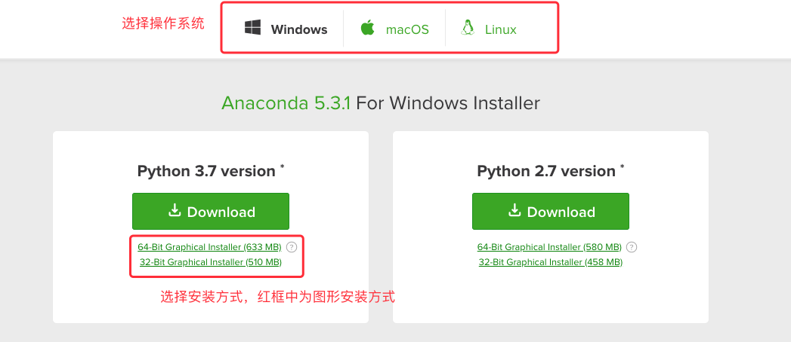
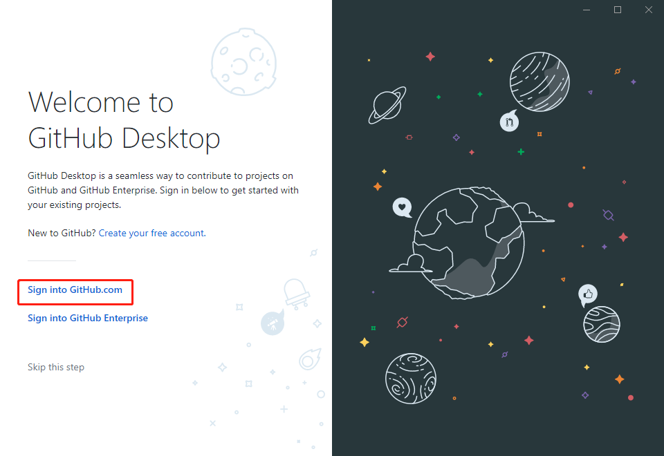
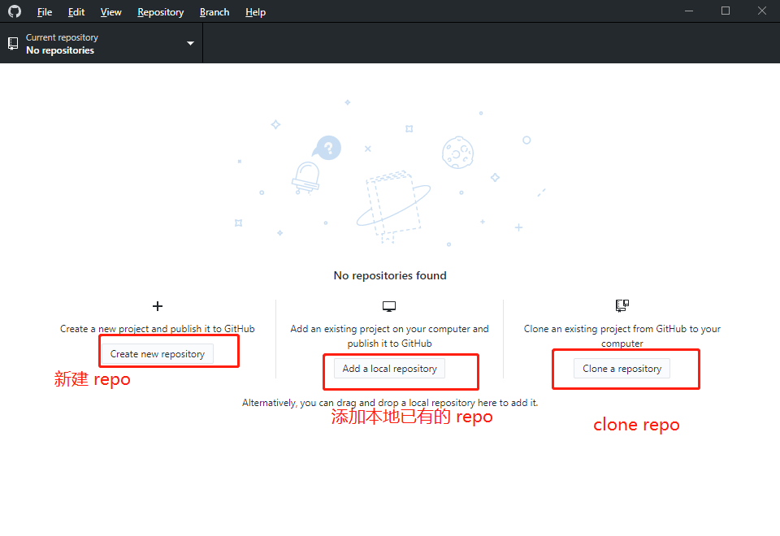
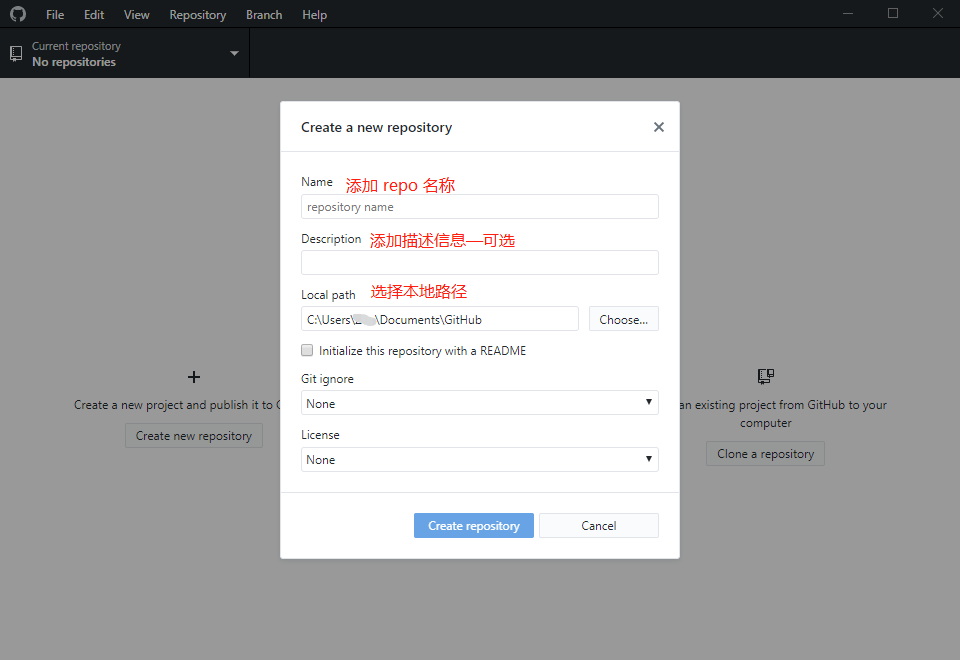
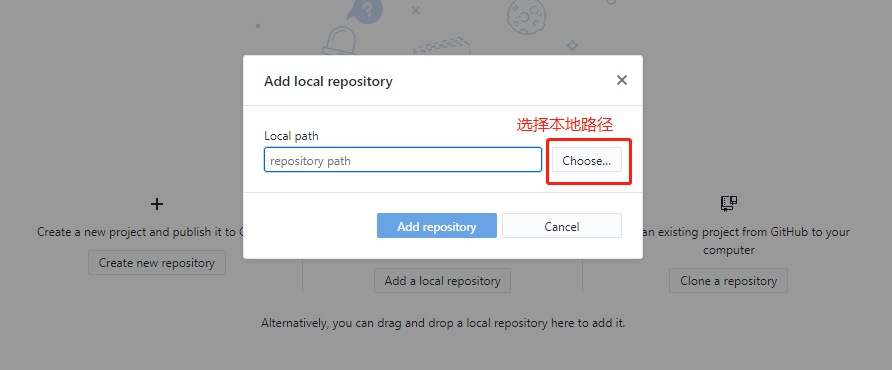
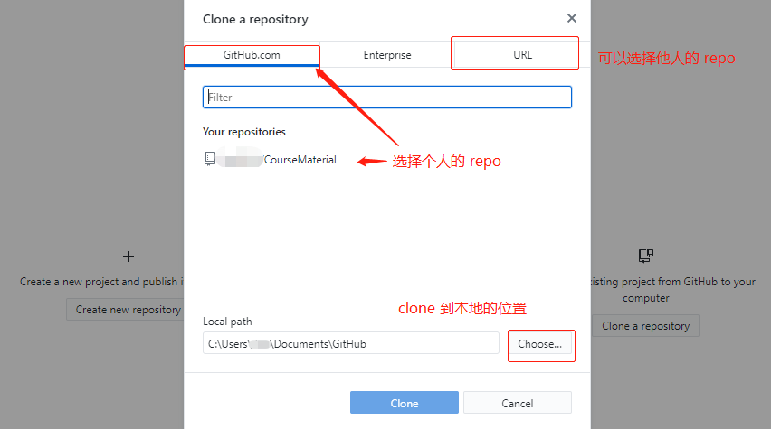
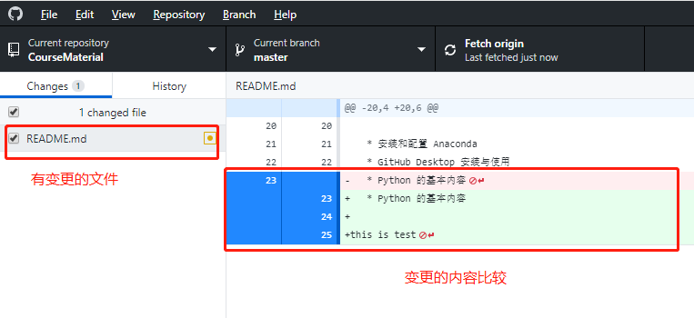

**目录：**

[TOC]


# 1. 安装和配置 Anaconda

Anaconda 安装可以参考课程中的内容（课程位置是在选修课部分，如有需要下载 Anaconda 可以通过[Downloads - Anaconda](https://www.anaconda.com/download/#windows) ）。需要注意选择对应的操作系统以及版本：



# 2. GitHub Desktop 安装

考虑到后续的项目中有 GitHub 项目，可以先将 GitHub 配置好以方便在完成项目之后将项目推送到 GitHub 中。此外为了简化操作的过程，推荐使用 GitHub Desktop 来进行管理项目。下载地址 [GitHub Desktop](https://desktop.github.com/)。安装完成之后进行配置：

1. 登录个人的账户
2. 添加 repo
3. 管理 repo——更新以及推送文件

## 2.1 登录

安装完成之后，登录个人的账户以完成配置



## 2.2 添加 repo

有三种方式可以选择：1）Create new repository；2）Add a local repo；3）Clone a repository



* Create new repository

  该方式直接新建一个 repo，当需要开始新的项目时，可以考虑该方式。它可以选择本地的文件路径，还有**其他可选项**——例如新建 repo 的同时初始化一个 README.md 文件、添加 `.ignore` 文件（用于表示哪些文件不需要进行 track）、选择证书类型（例如 GNU License、MIT License）。

  

* Add a local repository

  该方式是将已有的项目添加为 repo。假设需要将之前的项目推送到 GitHub 的时候，可以通过该方式。它是直接将本地的文件夹路径添加为 repo。**注意** 该方式需要本地的文件夹中包括了 `.git` 文件夹——也就是说需要完成 `git init` 步骤，如果没有该步骤的话，需要使用 `Create new repository` 的方式

  

* Clone a repository

  该方式是克隆一个库——可以将其作为复制库来看待。该方式需要一个 GitHub 上的 repo ——它可以选择个人的 repo，或者是其他人的 repo；此外可以选择克隆到本队的位置

  

## 2.3 管理 repo

管理 repo 的方式，和使用 git 命令来管理方面的逻辑是相同的：

* 编辑项目文件
* 提交 commit
* push commit

注意：在此处没有涉及 pull（将远程内容更新到本地），git 管理的原理，branch 管理以及怎么写规范的 commit 内容——详情参考网络内容[^1]

1. **编辑项目文件**

   编辑项目文件，和正常书写文件内容的方式一样。当进行保存是，在 change 选项卡下会提示哪些内容有变更。通过比较变更内容可以确认是否需要保存当前的变更，以确认是否需要进行后续的操作。

   

   上图说明了变更的文件以及变更的内容，分别增加了 `this is test` 的内容、换行以及增加和删除了一行内容。

2. 提交 commit

   当使用 git 命令操作时，提交 commit 步骤为：

   ```bash
   $ git add <file>
   $ git commit -m <message>
   ```

   在使用 GitHub Desktop 的情况下，只需要添加相应的 commit 信息即可，点击 commit 按钮会将保存当前提交信息：

   

3. push commit

   当完成以上的内容之后，需要考虑将内容 push 到远程仓库。此时需要使用 Repository 下的选项来完成相应的操作：例如 Push——推送本地的 commit 信息到远程，Pull——将远程的 repo 更新内容同步到本地

   

# $\rm A$. 参考

[^1]: [Commit message 和 Change log 编写指南](http://www.ruanyifeng.com/blog/2016/01/commit_message_change_log.html)