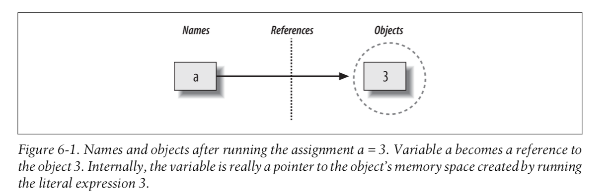

**第一次分享目录：**

1. [安装和配置 Anaconda](./Anaconda与GitHubDesktop配置.md)
2. [GitHub Desktop 安装与使用](./Anaconda与GitHubDesktop配置)

[TOC]

# $\rm I$. 变量

Python 动态、解释型语言，在使用过程中不需要去**申明变量类型、数据长度** 等。在写代码的时候，需要首先明白变量的意义。变量其实可以看作是一个具有名称的“容器”（本质上是一个存储地址），它引用了处理的对象（Object，包括函数对象、数据对象等）——这里需要理解一点 **类型是属于对象，而非变量**。



变量引用的对象具有一定的生命周期，而且又因为其作用域（Scope）差异可以将变量的类型分为全局变量、局部变量以及静态变量、实例变量（后两者和 Class 相关，在数据分析的角度来说不需要详细了解）。此处主要从全局变量和局部变量两个角度来说，在此之前需要了解一下作用域。

**变量作用域**是指可以在程序的哪个部分引用或使用某个变量。所谓作用域内的变量，可以当作一个房间中可以被使用的物品——它说明了哪些东西可以使用，同时还需要注意房间内的“人”可以使用楼层、小区等的公共空间的物品；反向的使用内部空间的物品确实肯定不能成功的——当然存在“例外”，那就是主动分享内部物品（这种情况下指申明变量为 global 时）。下图是变量搜索（或者说调用）路径——LEGB，先搜索局部命名空间，之后是全局命名空间（闭包函数没有要求）。


## 1.1 全局变量

全局变量[^3]，指在所有的作用域都可以访问的变量。一般情况下，在 Local namespace 之上的变量可以被看作是全局变量（实际上需要参考上图）

## 1.2 局部变量

局部变量，指在局部命名空间内的变量。假设从函数的角度来看，如果函数内部变量没有特殊申明的情况下，那么该变量就是局部变量。

此外在函数中需要注意，其参数是对对象的引用，因此在使用数据的时候会因为数据类型不同而表现出差异——特别是可变类型的数据，例如 list、dict 、set等

```python
var = [1, 2]

def test(var):
	var.append(3)
	
# 使用列表的情况，因为函数的参数是引用该数据，列表可以通过 append 更改元素数据
# 这时全部变量 var 的数据也会变化
test(var)
print(var)

# output
[1, 2, 3]
```

因此函数中的参数需要**⏰谨慎**判断需要的数据，考虑是否需要变更。

# $\rm II$.数据类型

Python 中的原子型数据，整型数据、浮点型数据、字符串数据、布尔型数据；容器类型数据，列表、元祖、字典以及集合。以上为 Python 的基本数据类型。首先需要对数据有这样的一个认识，数据类型决定了可以使用的方法，特别在做数据处理的时候需要依据解决问题来判断我们使用什么数据类型。当然还有其他的数据，例如 pandas 中的 DataFrame、Series；Numpy 中的 ndarray。

## 2.1 数值数据

数值型数据，包括整型数据和浮点数型数据。从表面上来看就是有没有小数位数的差异——`2` 和 `2.0` 是两种不同的数据类型。两者可以互相转换直接使用对应的 `int()` 后者 `float()` 方法可显性强制转换。此外还需要注意，浮点数和整型数据相乘的结果是浮点数——隐式转换

## 2.2 布尔数据

布尔值就是真假值——True 或者 False，一般用于逻辑判断，此外可以用于 if，while 等需要逻辑判断的语句中。 除了简单的逻辑判断还需要注意，逻辑联结词的—— and， or， not。此外在数学意义来说，True 可以表示为 1，而 False 表示为 0。~~一般情况下任何可以表达出非零意思的数据都可以表达为True。~~ 如果需要检验数据布尔值，可以直接用 `bool()` 进行检验

## 2.3 字符串数据

Python 不区分字符和字符串，可以使用单引号和双引号来表示该类型数据。需要注意，如果字符串内都引号那么需要使用逃逸符或者不同的引号。

字符串之间可以运行相加运算，字符串和整型数据之间可以相乘。

```python
In [54]: "ab" + "cd"
Out[54]: 'abcd'

In [55]: "ab" * 3
Out[55]: 'ababab'
```

## 2.4 容器类型数据

内置的序列数据包括列表、元组，字典和集合——注意⚠️字符串也是一个序列型数据。其中某些序列中的元素不可以直接被修改，某些元素可以被直接修改，例如元组中的元素直接修改。集合没有索引信息（因为它是无序的）。

```python
In [58]: a = (1,2, 3, "a")

In [59]: a[0] = 21
---------------------------------------------------------------------------
TypeError                                 Traceback (most recent call last)
<ipython-input-59-a3693b3d9970> in <module>()
----> 1 a[0] = 21

TypeError: 'tuple' object does not support item assignment

In [56]: a = {1, 2, 3, }
In [56]: a = {1, 2, 3, }

In [57]: a[1]
---------------------------------------------------------------------------
TypeError                                 Traceback (most recent call last)
<ipython-input-57-8bc71255a22e> in <module>()
----> 1 a[1]

TypeError: 'set' object does not support indexing
```

谈到索引，就需要知道索引代表了元素在序列数据中的位置，起始位置为 0。

谈到不可变序列，那就必须说一下元组——⚠️注意元组在被命名赋值的过程中可以不需要括号。它可以用于存储固定的信息，另外一个比较常用的就是解包——通常用于函数或者方法的参数

```
# 下面将元组元素解包到列表中
In [62]: [*(1,2,3)]
Out[62]: [1, 2, 3]

# 下面是作为 format 方法的参数
dimensions = 52, 40, 100
length, width, height = dimensions
print("The dimensions are {} x {} x {}".format(length, width, height))
```

另外在数据嵌套中的下层元素特性不由上层决定，而是由其本身决定。也就是说元组中嵌套列表，列表的元素可变的，而不会元组影响

```python
In [65]: a = (1,2, [13, 12, 4, 6, "b", "c"])

In [66]: a[2][-1] = "100"

In [67]: a
Out[67]: (1, 2, [13, 12, 4, 6, 'b', '100'])
```

# $\rm III$. 控制流

## 3.1 条件语句与逻辑表达式

条件语句，是说据逻辑判断来控制语句的走向，首先需要明确的几点——它有一个可以得到逻辑结果的判断语句或者本身就是一个逻辑值；此外需要注意语句运行是从上到下进行，所以在写条件的时候需要注意⚠️💣顺序

if 语句的结构，包括1）单一 if，仅有一个 if 语句；2）if-else，如果满足条件运行 if 的模块，否则运行 else 模块；3）if-elif-else，这中方式可以使用多个 elif，这样即可以使用多个条件控制流程

```python
if test_expresssion:
	chunck_body
[elif test_expression_1:
	chunck_body1]
[elif test_expression_2:
	chunck_body2]
[else:
	chunck_body3]
# 上面的语句中 else 和 elif 是可选的
```

基本的逻辑结构走向如下图：


在逻辑表达式中，使用 and（可以用 & 符号表示），or（可以用 | 符号表示），not。对于前两个需要注意判断的顺序，and 是在检查到最右侧的条件判断满足才是为真，中间有哪一步不符合即停止检查；而 or 是检查到左侧有为真的条件，即终止检查。

此外在进行数据比较的过程中，可能会用到 `==` 和 `is` 两种方式。这两种具有差异：1）`==` 用于比较两个数据是否相等；2）`is` 用于比较两个数据数据是否是一致的，简单来说就是比较两个数据是否在同一个存储地址中。下面的例子可以有助于理解这个问题：

```python
In [9]: 2 ** 3 is 2 ** 3, 2 ** 32 is 2 ** 32
Out[9]: (True, False)
# 小数据的对象可以直接引用自同一个地址，但是大数据就不能这样
In [10]: 2 ** 3 == 2 ** 3, 2 ** 32 == 2 ** 32
Out[10]: (True, True)
```


## 3.2 循环之 for

在 python 中主要有两种循环，一种是 for，另一种是 while。for 相当于可迭代对象的内容遍历（例如需要检查水果篮里面的水果，把里面的水果一个个拿出来看——这就是遍历），对内容元素做出处理；此外还是可以使用 for 语句来完成循环次数的控制，这种情况下是对遍历的元素不做处理——常见的 range 函数。


```python
# range 函数可以得到一个 range 对象——本质上就是一个可迭代对象。提示如果要查寻变量或者数据的数据类型可以使用 type
for i in range(3)：
	print("hello!")
```

## 3.3 循环之 while

while 循环的作用就是为了根据内容判断是否符合要求，如果如何要求进入循环体内操作，否则退出循环。代码结构如下：

```python
while condition_expresssion:
	loop_body
    
# condition_expression 是一个条件表达式，需要判断这个表达式是否满足条件来确认是否进入 loop_body
```

一般来说，while 循环的循环体内会有一个可变化的变量，用于在条件表达式中确认是否可以终结循环。另外也可以使用 if 语句和调用 break 的方式来终止循环。

```python
a = 0
while a < 10:
	print(a)
	a += 1
# 上面是使用了变量 a 的变化，来确认循环是否继续。下面是使用 if 方式

a = 0

while True:
	print(a)
	if a >= 10:
		break
	a += 1
```

while 语句的逻辑结构如下图：


## 3.4 循环内部控制—— break 与 continue

break 和 continue 是在循环体内控制循环的语句。其中 break 只能终止当前循环体内的循环，如果是嵌套的循环该循环之外的循环是不被终止的：

```python
for i in range(2, 10):
     for e in range(3, 8):
         if (e % 2) == 0:
             print(e)
         else:
             break
     print(i)
     
 # 因为嵌套的第一个迭代元素是 3，是奇数而运行 break，但是外部循环没有终止
 # output
2
3
4
5
6
7
8
9
```

continue 的作用比较简单，那就是直接跳过当前循环：

```python
for i in range(2, 10):
     for e in range(3, 8):
         if (e % 2) == 0:
             print('e=',e)
         else:
             continue
     print('i=',i)
     
 # output， e 不会输出奇数数据
e= 4
e= 6
i= 2
e= 4
e= 6
i= 3
e= 4
e= 6
i= 4
e= 4
e= 6
i= 5
e= 4
e= 6
i= 6
```

# $\rm IV$. 数据的高阶处理

## 4.1 可迭代对象处理

主要是可以使用 zip 将可迭代对象进行重新组合成一个新的可迭代对象 `list(zip(['a', 'b', 'c'], [1, 2, 3]))` 等于 `[('a', 1), ('b', 2), ('c', 3)]`。组合的方式是两个可迭代对象的相同索引位置上的元素进行组合，形成一个新的可迭代对象。

而 enumerate 的作用是返回可迭代对象的索引值和元素值组成的一个新可迭代对象。

## 4.2 列表推导式和元组解包

列表解析和元组解包都是对数据拆解的一种方式，但是使用的场景不用。列表解析用于可迭代对象的元素的快速处理，而元组解包一般用于函数参数传入参数值——~~一般是被当作位置参数的值传入~~。

```python
# 列表解析
[x**2 for x in range(9) if x % 2 == 0]

# output
[0, 4, 16, 36, 64]

[x**2 if x % 2 == 0 else x + 3 for x in range(9)]

# output
[0, 4, 4, 6, 16, 8, 36, 10, 64]

# 元组解包
print("{0} != {1}".format(*(1, 2)))

# output
1 != 2
```

## 4.3 匿名函数——lambda

使用 Lambda 表达式创建匿名函数，即一类无需定义标识符（函数名）的函数或子程序。lambda 表达式非常适合快速创建在代码中以后不会用到的函数。尤其对高阶函数（例如：map，filter，reduce 等）或将其他函数作为参数的函数来说，非常实用。代码结构：`lambda arg1,arg2,...,arg2:function_body`，不再需要使用 return 关键字，直接可以返回值。匿名函数也可以“有名称”调用：

```python
double = lambda x, y: x * y
double(2, 3)

# output
6
```

高阶函数中使用 filter 来做说明，对于这类函数需要弄清楚其相关说明：

- `filter`(*function*, *iterable*)

  Construct an iterator from those elements of *iterable* for which *function* returns true.  *iterable* may be either a sequence, a container which supports iteration, or an iterator. If *function* is `None`, the identity function is assumed, that is, all elements of *iterable* that are false are removed.Note that `filter(function, iterable)` is equivalent to the generator expression `(itemfor item in iterable if function(item))` if function is not `None` and `(item for itemin iterable if item)` if function is `None`.See itertools.filterfalse() for the complementary function that returns elements of *iterable* for which *function* returns false.

也就是说第一个参数 `function` 是一个可以调用函数用于对数据进行处理

```python
# 删除空字符串
def not_empty(s):
    return s and s.strip()

list(filter(not_empty, ['A', '', 'B', None, 'C', '  ']))
# output
['A', 'B', 'C']

# 上面的代码可以进行重构
list(filter(lambda x: x and x.strip(), ['A', '', 'B', None, 'C', '  ']))
```

## 4.3 迭代器和生成器

**迭代器**是每次可以返回一个对象元素的对象，例如返回一个列表。到目前为止使用的很多内置函数（例如 enumerate）都会返回一个迭代器。它是一种表示数据流的对象。这与列表不同，列表是可迭代对象，但不是迭代器，因为它不是数据流。Python 的 Iterator 对象表示的是一个数据流，`Iterator`对象可以被 `next()` 函数调用并不断返回下一个数据，直到没有数据时抛出 `StopIteration` 错误。可以把这个数据流看做是一个有序序列，但我们却不能提前知道序列的长度，只能不断通过 `next()` 函数实现按需计算下一个数据，所以 `Iterator` 的计算是惰性的，只有在需要返回下一个数据时它才会计算。`Iterator` 甚至可以表示一个无限大的数据流，例如全体自然数。而使用 `list` 是永远不可能存储全体自然数的。可以使用 `iter` 函数对可迭代对象创建迭代器

**生成器**是使用函数创建迭代器的方式；要创建一个 `generator`，有很多种方法。第一种方法很简单，只要把一个列表生成式的 `[]` 改成 `()`，就创建了一个`generator`。

使用生成器的函数，重要是明白 `return` 和 `yield` 的区别，`yield` 是对数据一个个抛出去处理数据，需要明白它运行流程[^5]。

**return 语句**

`return` 语句可以在函数定义中，和类定义中。一般用法，函数中有值，返回值；如果没有值，那么将返回 `None` 值。一般情况下，在函数内遇见 `return` 语句会跳出函数表示函数运行完成；但是在遇到 `try-finally` 语句时，函数运行时在 `finally` 之后才算完成。下面的例子说明了 `finally` 语句是必须运行的：

```python
# python 3.x
def test_return():
    a = 1
    try:
        return a / 0
    except:
        print("something wrong")
        return "return statement"
    finally:
        print("finally statement")

print(test_return())
# output        

something wrong
finally statement
return statement
```

**yield 语句**

`yield` 语句及表达式，被用于生成器函数的函数体中。主要被用于实现异步；另外可以将数据逐渐一部分的数据流方式传递出函数，这样达到产生可迭代对象的效果。但是需要注意 `yield` 语句运行完成后，函数内的后续语句不是受它控制，即相关语句还是会继续完成。视频 [python 的 yield 传递数值方式](https://www.bilibili.com/video/av23757923) 使用 `debug` 的方式，对 `yield` 进行了模拟，注意 `watch` 中的变量值变化以及语句运行时的跳转。

# $\rm A$. 参考

[^1]: [变量 (程序设计)](https://zh.wikipedia.org/wiki/%E5%8F%98%E9%87%8F_(%E7%A8%8B%E5%BA%8F%E8%AE%BE%E8%AE%A1))
[^2]: python学习手册
[^3]: [全局变量](https://zh.wikipedia.org/wiki/%E5%85%A8%E5%B1%80%E5%8F%98%E9%87%8F) 