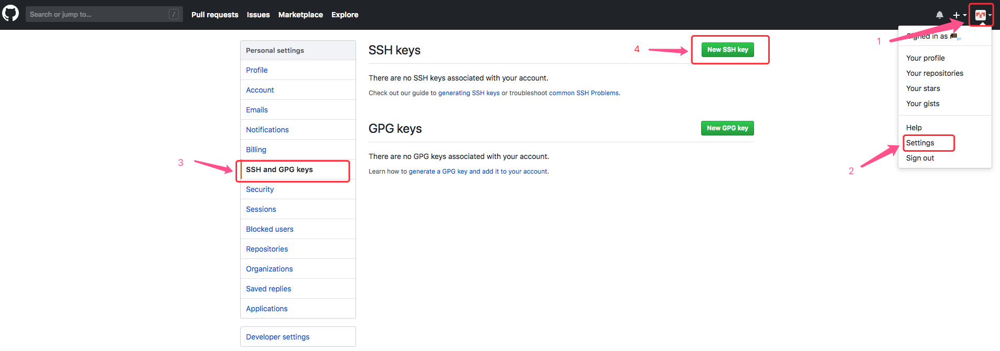
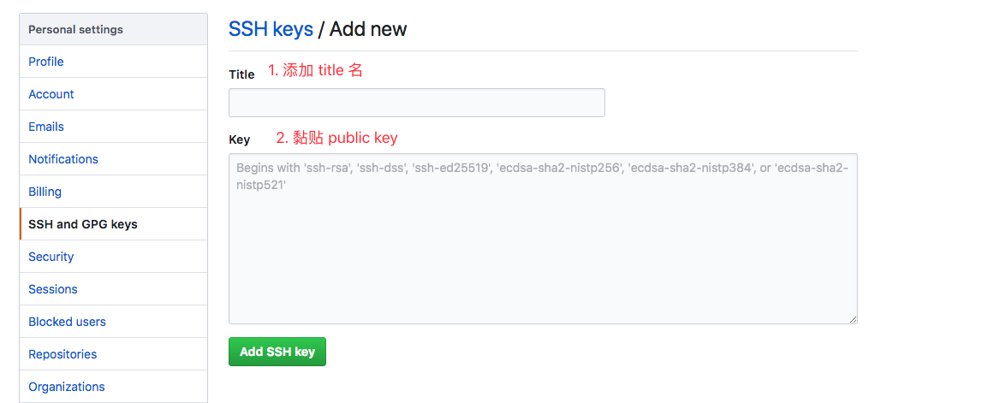
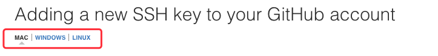

**目录：**

[TOC]

# $\rm I$. `GitHub` 配置

内容不涉及注册 GitHub 的账户，主要**关注点** 是注册好用户名之后配置，包括的内容：

1. 使用 ssh-keygen 生成 ssh key
2. 将 private key 添加到本地 ssh-agent
3. GitHub 配置 public key 

```bash
<<'COMMENT'
最好是在 .ssh 文件夹（MacOS 或者 Linux 下的默认位置是 ~/.ssh）下进行操作。需要完成的操作如下：
1. 如有必要，需要生成一个 SSH key
2. 确认 SSH 服务已经启动
3. 将 SSH private key 添加到 ssh-agent
以上过程需要在本地完成操作
COMMENT

# 使用 ssh-keygen 来生成 ssh key，命令格式如下：
# -t 需要添加 key 类型，例如 rsa, ed25519, ecdsa
# -f 申明将密码存储在特定的文件下，确认文件名称
# -b 申明 key 的位数大小
# -C 添加一个注释
# ssh-kegen -t filetype -f ssh_key_name -b number_bits -C comment
$ ssh-keygen -t rsa -f rsa_test -b 4096 -C "test@test_mail.com"

Generating public/private rsa key pair.
Enter passphrase (empty for no passphrase): # 可选择是否需要输入
Enter same passphrase again:
Your identification has been saved in rsa_udacity.
Your public key has been saved in rsa_udacity.pub.
The key fingerprint is:
SHA256:2bcxd5TDwI01C3Iujk080XLdAlwSAberMVLv+3BkZxQ test@test_mail.com
The key's randomart image is:
+---[RSA 4096]----+
|          B*O*++.|
|         .oX ++oo|
|        .o*o+ +E.|
|       . o+* .. .|
|        S .+o   .|
|            +*+o |
|            o*=o.|
|            ..+o.|
|            .... |
+----[SHA256]-----+

# 接下来第二步，测试 ssh-agent 是否已经启动。如果提示了 pid 值那么表示已经启动
$ eval "$(ssh-agent -s)"

Agent pid 49547

# 添加 private key 到 ssh-agent
$ ssh-add -K ~/.ssh/rsa_test

Identity added: /Users/new_user/.ssh/rsa_test (/Users/new_user/.ssh/rsa_test)
```

通过以上步骤生成了 ssh-key [^1][^2]，同时将 private key 添加到了 ssh-agent 中。接下来需要在 GitHub 中添加 public key[^3]。

```bash
<<'COMMENT'
接下来完成配置 GitHub 中的 public key
1. 复制 public key
2. 在 GitHub 中个人界面下 Setting 中去添加 public key
COMMENT

# 复制 private key 对应的 public key（扩展名为 .pub）
$ pbcopy < ~/.ssh/rsa_test.pub

# 将数据黏贴至 GitHub 个人页面下的 Setting 中进行配置
```

在页面 `https://github.com/settings/keys` 完成配置：



在设置的过程，需要添加标题和黏贴 public key



**注意事项**

此外，需要注意⚠️上面命令主要的 Mac OS 系统中，部分命令存在差异——例如，pbcopy 无法在 Linux 和 Windows 中使用。具体的系统命令，可以通过选择不同按钮查看：




# $\rm A$. 参考

[^1]: [Generating a new SSH key and adding it to the ssh-agent](https://help.github.com/articles/generating-a-new-ssh-key-and-adding-it-to-the-ssh-agent/#adding-your-ssh-key-to-the-ssh-agent) 
[^2]: [ssh-keygen(1) - Linux manual page](http://man7.org/linux/man-pages/man1/ssh-keygen.1.html) 
[^3]: [Adding a new SSH key to your GitHub account - User Documentation](https://help.github.com/articles/adding-a-new-ssh-key-to-your-github-account/) 